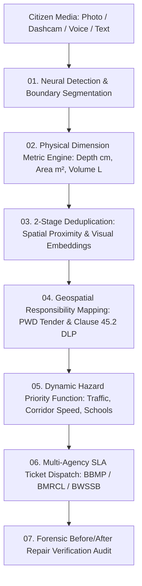

<div align="center">

# 🚦 CivicPulse Bengaluru
### Next-Generation AI Pothole Intelligence & Municipal Accountability Ledger

<p align="center">
  <strong>See the problem. Identify responsible contractors. Audit repairs with forensic computer vision.</strong>
</p>

[](https://react.dev/)
[](https://www.typescriptlang.org/)
[](https://vitejs.dev/)
[](https://tailwindcss.com/)
[](https://clerk.com/)
[](https://leafletjs.com/)
[](https://irc.nic.in/)
[](LICENSE)

---

</div>

## 📌 Executive Overview

Bengaluru's recurring road surface crisis is not merely an asphalt durability challenge—it is an **algorithmic prioritization and contractual accountability failure**:

* ⚡ **Subjective Repair Dispatch:** Legacy portals prioritize potholes based on VIP movement, social media virality, or political pressure rather than physical vehicle hazard metrics.
* 📦 **Duplicate Ticket Spam:** A single crater on the Outer Ring Road generates dozens of separate, unlinked grievances—clogging ward engineering queues and diluting emergency response.
* 📜 **Evading Contractor Liability (Clause 45.2):** Standard Karnataka PWD and BBMP road contracts enforce a mandatory **36-Month Defect Liability Period (DLP)**. When asphalt fails prematurely, private contractors routinely evade rectification notices, burdening taxpayers with secondary patchwork bills.
* 🌧️ **Unverified Temporary Patching:** Potholes are cosmetically filled with loose cold-mix gravel that washes away in monsoon rains, with municipal tickets prematurely marked "RESOLVED" without forensic proof.

**CivicPulse Bengaluru solves this end-to-end** through automated computer vision telemetry, multimodal voice-to-text NLP triage, geospatial parcel contract mapping, and automated before/after repair verification.

---

## ⚡ 7-Stage Intelligence Pipeline



---

## 🎨 Neo-Brutalist Design System

CivicPulse is styled with a distinct, high-density **Neo-Brutalist Command Center** interface engineered for municipal operations:

| Token | Hex Code | Visual Swatch | Operational Function |
|---|---|:---:|---|
| **Sage Canvas** | `#CFE8D6` | 🟢 | Primary soft tint, header surfaces, pill badges & elevation highlights |
| **Obsidian Ink** | `#121210` | ⚫ | High-contrast borders (`3px solid`), brutalist shadows & typography |
| **Forest Verifier** | `#2E8C42` | 🟩 | Confirmed detections, verified repairs & DLP warranty compliance |
| **Amber Warning** | `#E8A030` | 🟧 | High hazard severity, NLP speech processing & SLA countdowns |
| **Crimson Alert** | `#C03A3A` | 🟥 | Critical emergency craters, active recording & SLA breaches |

---

## 🌟 Core Modules & Capabilities

### 🎙️ 1. Multimodal Voice & Text Intake Cockpit
* **Real-time Neural STT:** Captures spoken Kannada/English complaints with continuous speech recognition (`en-IN`), preserving verbatim spoken context without hardcoded overwrites.
* **Corridor NLP Resolution:** Automatically identifies arterial corridors (Outer Ring Road, Indiranagar 100ft Rd, Whitefield ITPL, Koramangala 80ft Rd, MG Road, Jayanagar, HSR Layout, etc.) and routes to responsible civic authorities:
  * 🏛️ **BBMP:** Major Roads Division & Ward Infrastructure
  * 🚇 **BMRCL:** Metro construction covenants & Phase 2A alignments
  * 💧 **BWSSB:** Pipeline excavations & drainage restoration cuts
  * ⚡ **BESCOM:** Underground HT cable trenches & utility reinstatement

### 🛰️ 2. GIS Radar
* Real-time spatial radar displaying all reported craters mapped across **198 BBMP Ward boundaries**.
* Layer toggles for arterial road corridors, contractor warranty zones, duplicate clusters, and priority heatmaps.
* Monocular stereoscopic telemetry rendering coordinates, elevation, and chainage.

### 🧠 3. Edge Computer Vision Lab
* Real-time crater bounding polygon localization with confidence scoring.
* Quantitative damage estimation calculating **subbase void area ($m^2$)**, **cavity depth ($cm$)**, and **aggregate volume ($L$)** compliant with **IRC-SP-100** standards.
* Risk evaluation modeling impact across two-wheelers, auto-rickshaws, and public transit corridors.

### 🔍 4. 2-Stage Spatial & Visual Deduplication
* **Stage 1 (Geospatial Gating):** Groups candidate reports within a 25-meter radial radius.
* **Stage 2 (Visual Cosine Similarity):** Compares feature embeddings across camera angles ($>85\%$ threshold) to merge repetitive grievances into a single consolidated **Master Dossier**.

### ⚖️ 5. Contractor DLP Ledger & Legal Notice Automation
* Queries public municipal contract packages and tender IDs associated with the defect coordinates.
* Automatically verifies whether the road is under active **Defect Liability Period (Clause 45.2)**.
* Generates legal **Defect Rectification Notices** addressed to contractor directors with automated SLA countdowns.

### 🔬 6. AI Before/After Repair Verification
* Dual-image photographic audit comparing the original crater against contractor repair photos.
* Computes **surface area reduction percentage** and calculates an **IRC-SP-100 Surface Smoothness Index (0–100)** to prevent substandard gravel filling.

### 🌌 7. Interactive 3D Scroll-World Flight
* High-performance spatial 3D flight camera navigating through Bengaluru's highway network.
* Interactive 3D camera waypoints illustrating edge AI inspection along the city's tech corridors.

---

## 📊 Algorithmic Priority Formulation

CivicPulse eliminates subjective political bias through an objective multi-factor hazard function:

$$\text{Priority Score} = w_1 \cdot S_{\text{severity}} + w_2 \cdot T_{\text{traffic}} + w_3 \cdot V_{\text{vulnerable}} + w_4 \cdot C_{\text{speed}} + w_5 \cdot U_{\text{citizen}}$$

* **$S_{\text{severity}}$ (35%):** Depth in cm, crater area, and loose aggregate risk
* **$T_{\text{traffic}}$ (25%):** Arterial vehicle density (ORR, Hosur Road, Airport Expressway)
* **$V_{\text{vulnerable}}$ (20%):** Proximity to schools, hospitals, and metro interchange nodes ($<200\text{m}$)
* **$C_{\text{speed}}$ (10%):** Corridor design speed limit ($>60\text{ km/h}$)
* **$U_{\text{citizen}}$ (10%):** Verified citizen upvotes & emergency crowd confirmations

---

## 🛠️ Technology Stack

```
Frontend Architecture
├── Framework:           React 19 (Hooks, Concurrent Mode)
├── Language:            TypeScript 5.7 (Strict Null Safety)
├── Build System:        Vite 8.3 (Hot Module Replacement, Rolldown Optimization)
├── CSS & Styling:       Vanilla CSS + Tailwind CSS (Neo-Brutalist Theme)
├── Mapping & GIS:       Leaflet + CartoDB Dark Matter Tiles
├── Authentication:      Clerk Auth (@clerk/clerk-react)
├── Icons:               Lucide React
└── Visual Effects:      Canvas Confetti, Lucide SVGs, Custom 3D Viewport

Backend & Inference Pipeline
├── API Service:         FastAPI / Python 3.11 (Uvicorn)
├── Vision Processing:   OpenCV 4.x + PyTorch Contour Analysis
├── Reverse Geocoding:   Custom Bengaluru GIS Spatial Engine
└── Legal Contract DB:   BBMP TenderSURE & PWD Clause 45.2 Records
```

---

## 🚀 Quick Start Guide

### Prerequisites
* **Node.js** `v20.0+` or `v22.0+`
* **npm** `v10.0+`
* **Python** `3.10+` *(optional, for local backend API)*

### 1. Clone & Install
```bash
# Clone the repository
git clone https://github.com/skandakn/CivicPulse.git
cd CivicPulse

# Install frontend dependencies
npm install
```

### 2. Environment Configuration
Create a `.env` file in the project root:

```env
# Clerk Authentication (Optional for offline demo mode)
VITE_CLERK_PUBLISHABLE_KEY=pk_test_...

# AI Speech-to-Text & Vision Keys (Optional - has resilient local fallbacks)
VITE_GEMINI_API_KEY=
VITE_GROQ_API_KEY=
```

### 3. Launch Development Server
```bash
npm run dev
```

Visit **`http://localhost:5173`** (or the port shown in your terminal) to explore CivicPulse.

### 4. Build for Production
```bash
# Type check and build production bundle
npm run build

# Preview production build locally
npm run preview
```

---

## 🏛️ Municipal Architecture Compliance

* **IRC-SP-100:2014:** Indian Roads Congress code of practice for road defect inspection and automated measurement.
* **Karnataka PWD Code (Clause 45.2):** Standard contract conditions governing mandatory contractor Defect Liability Periods.
* **BBMP Sahaya 2.0 Integration:** Municipal grievance lifecycle formatting (`BBMP-SHY-2026-XXXXX`).

---

## ⚖️ License

Distributed under the **MIT License**. Open source for civic transparency and municipal engineering enhancement.
